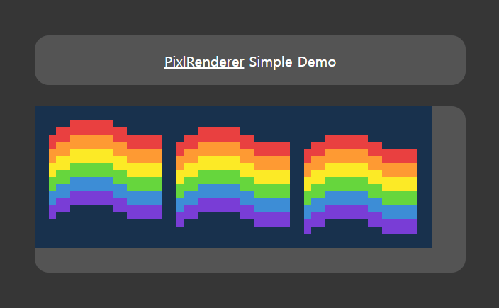

# Pixl-Renderer

A simple pixel art animation renderer using canvas

## Quick Start

### Add to project

Include in your HTML.

```html
<script src="path/to/pixlrenderer.js"></script>
```

### Creating a new Pixl JSON

Recommended to create through a script such as [gif2json](gif2json/README.md).

You can append more frame to `frames` array to define animated gif or multiple images sharing palette.

```json
{
    "width": 16,
    "height": 14,
    "palette": [
        "#793dd6",
        "#fe9a33",
        "#e94040",
        "#3d8dd6",
        "#66d63d",
        "#fcea26",
        "#18314d",
        "#ffffff"
    ],
    "frames": [
        [
            6, 6, 6, 2, 2, 2, 2, 2, 2, 6, 6, 6, 6, 6, 6, 6,
            6, 2, 2, 2, 2, 2, 2, 2, 2, 2, 2, 6, 6, 6, 6, 6,
            2, 2, 2, 1, 1, 1, 1, 1, 1, 2, 2, 2, 2, 2, 2, 2,
            2, 1, 1, 1, 1, 1, 1, 1, 1, 1, 1, 2, 2, 2, 2, 2,
            1, 1, 1, 5, 5, 5, 5, 5, 5, 1, 1, 1, 1, 1, 1, 1,
            1, 5, 5, 5, 5, 5, 5, 5, 5, 5, 5, 1, 1, 1, 1, 1,
            5, 5, 5, 4, 4, 4, 4, 4, 4, 5, 5, 5, 5, 5, 5, 5,
            5, 4, 4, 4, 4, 4, 4, 4, 4, 4, 4, 5, 5, 5, 5, 5,
            4, 4, 4, 3, 3, 3, 3, 3, 3, 4, 4, 4, 4, 4, 4, 4,
            4, 3, 3, 3, 3, 3, 3, 3, 3, 3, 3, 4, 4, 4, 4, 4,
            3, 3, 3, 0, 0, 0, 0, 0, 0, 3, 3, 3, 3, 3, 3, 3,
            3, 0, 0, 0, 0, 0, 0, 0, 0, 0, 0, 3, 3, 3, 3, 3,
            0, 0, 0, 6, 6, 6, 6, 6, 6, 0, 0, 0, 0, 0, 0, 0,
            0, 6, 6, 6, 6, 6, 6, 6, 6, 6, 6, 0, 0, 0, 0, 0
        ]
    ]
}
```

### Embed to your page

Add a div to your HTML that will be used as the rendering target.

```html
<div id="rainbow"></div>
```

### Configure

Configure a new `PixlRenderer` object.

```js
const container = document.getElementById('rainbow');
const width = 56;
const height = 20;

var objects = [];

const pixlr = new PixlRenderer(
    container,  // Target div
    width,      // Rendering width (number of pixels)
    height,     // Rendering height (number of pixels)
    20,         // Size of pixels (px)
);

pixlr.setBackground('#18314D'); // Set background color (optional)
```

### Load New Pixlr JSON

Load a pre-created `Pixlr JSON`.

#### Load From Object

Load JSON using another library and use `addImage()`. Useful for adding multiple images sharing same **Pixlr JSON**.

Returns `ObjectID` of loaded image.

```js
require('path/to/pixl.json', (data) => {
    for (let i = 0; i < 2; i++) {
        let objectID = pixlr.addImage(data);
        objects.push(objectID);
    }
});
```

You can find [require](docs/scripts/loader.js) here(Simple wrapper creating XHR request for JSON).

#### Load From URL

Use `addImageFrom()` to load json from url.

Passes `ObjectID` of loaded image to callback.

```js
pixlr.addImageFrom('path/to/pixl.json', (id) => {
    objects.push(id);
})
```

### Render

You should create rendering information for each images.

```js
var renderInfo = {}

for (let i of objects) {
    renderInfo[i] = {
        fid: 0,                 // Render 0th frame of object which has ObjectID i
        offsetX: 2 + 18 * i,    // at OffsetX: 2 + 18 * i
        offsetY: 1 + i          // at OffsetY: 1 + i
    }
}

pixlr.render(renderInfo);
```

### Result

* [Simple demo](https://nyan.aquai.ro/simple.html)
* [Animated demo](https://nyan.aquai.ro)



## Other methods

### Resize

You can dynamically change rendering resolution by `resize()`.

```js
window.onresize = debounce(() => {
    pixlr.resize(
        Math.ceil(rainbow.offsetWidth / psize),
        Math.ceil(rainbow.offsetHeight / psize)
    );
}, 100)
```

You can find [debounce](docs/scripts/debounce.js) here(Simple implementation of debouncing)