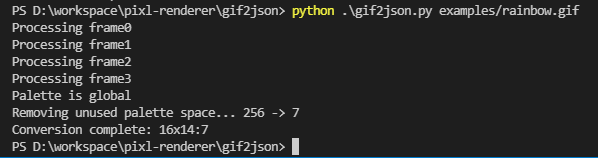
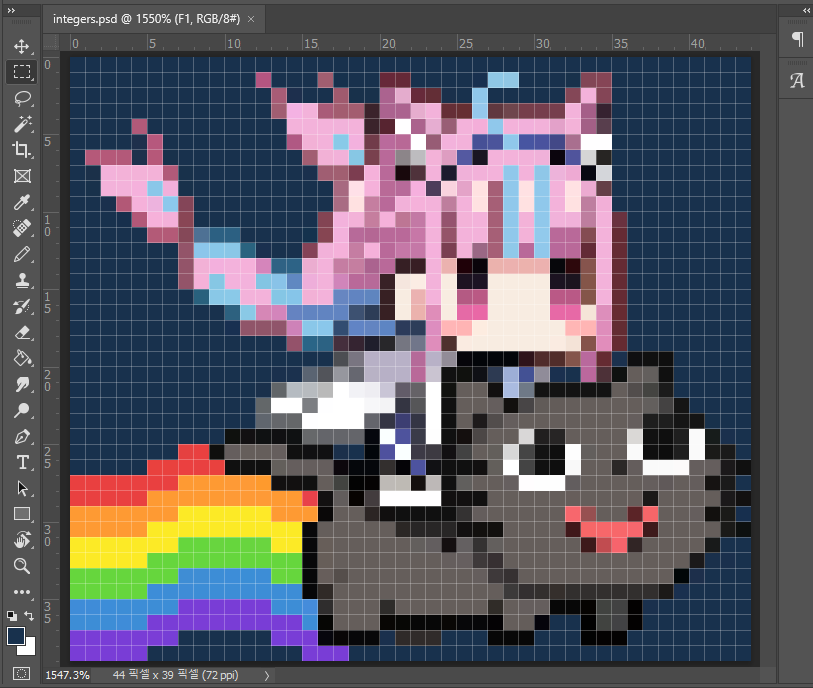

# gif2json.py

Python script that converts gif image into **Pixlr JSON**.

## Usage



```
$ python gif2json.py /path/to/image.gif
```

Output JSON will be saved at `/path/to/image.json`.

### Requirements



Source GIF file must be **Pixel-Scaled** Image. Otherwise, 